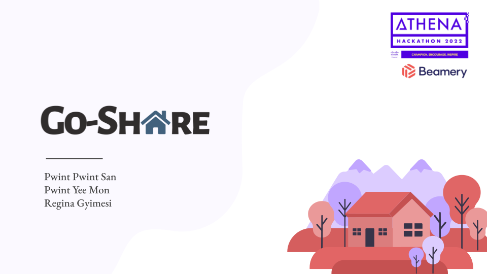

# Go-Share

Go-Share aims to connect volunteers with refugees that need free accommodation. Anything can be shared that is comfortable for a person to live in: spare rooms, family houses and even bungalows. The worldwide search makes it incredibly easy to connect the guest to the host and enables a flexible and quick solution when a person experiences hardship.

# Submission and pitch
ShowCode submission and pitch [link](https://app.showcode.io/project/a97cc0be-c125-46a5-a96d-8f37a74e6866).

# Visuals

